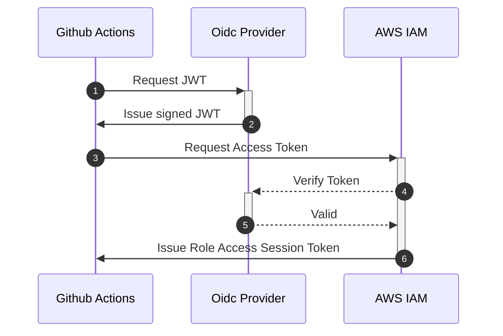

# Terraform AWS GitHub Actions /w OIDC

This module configures AWS OIDC authentication with GitHub Actions, eliminating the need for static AWS IAM Access Keys
when running Terraform within GitHub Actions.

## GitHub Actions temporary AWS role credentials

We can use OpenID Connect within our workflows to authenticate with Amazon Web Services and get temporary session tokens
to assume IAM roles.

### Usages

The module is at the time of writing super opinionated in how the AWS IAM Open ID Connect Provider is created. The only
thing the user needs to be concerned about is the `var.condition`. This needs to be set up the trust policy for
the `sub` field, which is explained
more [here.](https://docs.github.com/en/actions/deployment/security-hardening-your-deployments/configuring-openid-connect-in-amazon-web-services#adding-the-identity-provider-to-aws)
We currently don't intend supporting GitHub Environments. However, this might be changed in the future.

### Examples

Check out the [examples](./examples) folder for using the module.

<!-- BEGIN_TF_DOCS -->
## Resources

| Name | Type |
|------|------|
| [aws_iam_openid_connect_provider.github_actions](https://registry.terraform.io/providers/hashicorp/aws/latest/docs/resources/iam_openid_connect_provider) | resource |
| [aws_iam_role.github_actions](https://registry.terraform.io/providers/hashicorp/aws/latest/docs/resources/iam_role) | resource |
| [aws_iam_role_policy_attachment.github_actions](https://registry.terraform.io/providers/hashicorp/aws/latest/docs/resources/iam_role_policy_attachment) | resource |
| [aws_iam_policy_document.github_actions](https://registry.terraform.io/providers/hashicorp/aws/latest/docs/data-sources/iam_policy_document) | data source |
| [tls_certificate.github](https://registry.terraform.io/providers/hashicorp/tls/latest/docs/data-sources/certificate) | data source |
## Inputs

| Name | Description | Type | Default | Required |
|------|-------------|------|---------|:--------:|
|  [condition](#input\_condition) | Github conditions to apply to the AWS Role. E.g. from which org/repo/branch is it allowed to be run. | `string` | n/a | yes |
|  [policy\_arn](#input\_policy\_arn) | List of ARNs of IAM policies to attach to IAM role. | `list(string)` | n/a | yes |
|  [role\_name](#input\_role\_name) | The name of the AWS Role which will be used to run Github Actions. | `string` | n/a | yes |
|  [role\_max\_sessions\_duration](#input\_role\_max\_sessions\_duration) | Maximum session duration (in seconds) that you want to set for the specified role. | `number` | `3600` | no |
|  [role\_permission\_boundary](#input\_role\_permission\_boundary) | Boundary for the created role. | `string` | `null` | no |
## Outputs

| Name | Description |
|------|-------------|
|  [openid\_connect\_provider](#output\_openid\_connect\_provider) | AWS OpenID Connected identity provider. |
|  [role](#output\_role) | AWS Role created |
<!-- END_TF_DOCS -->
